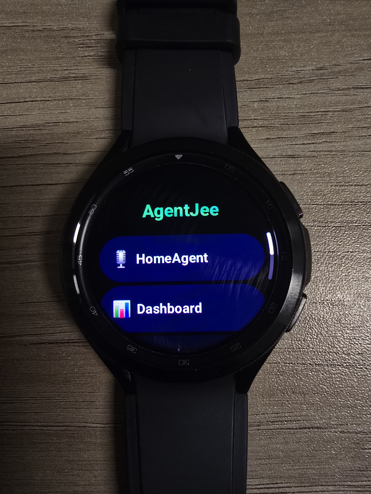
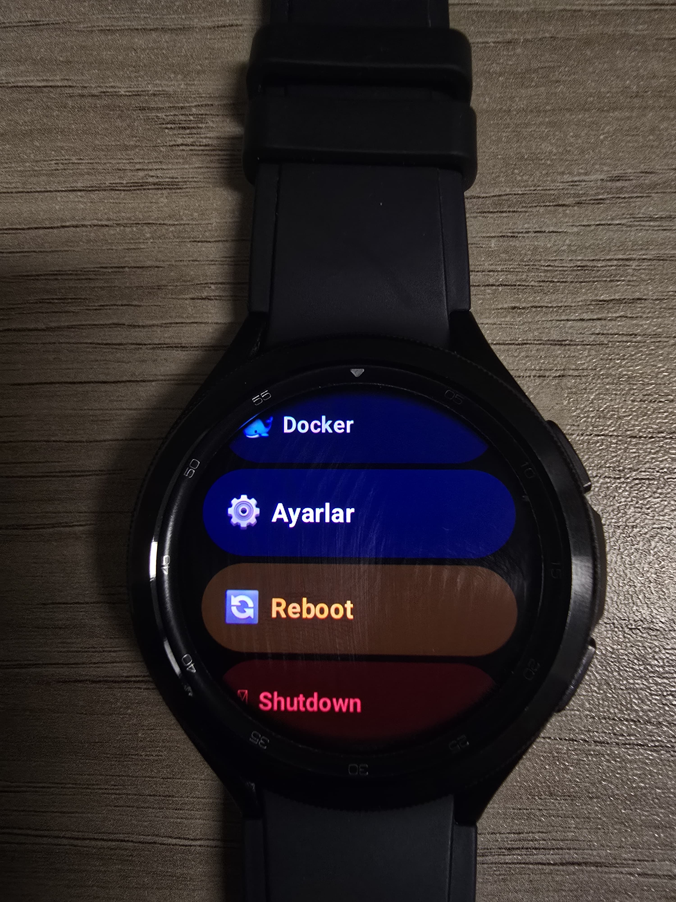
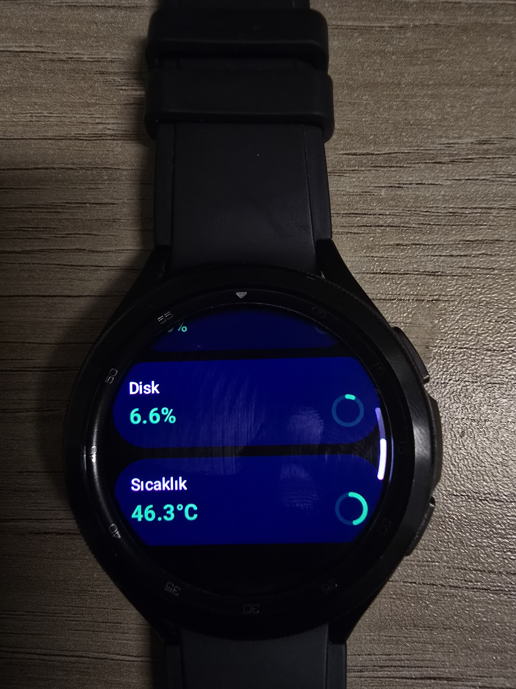
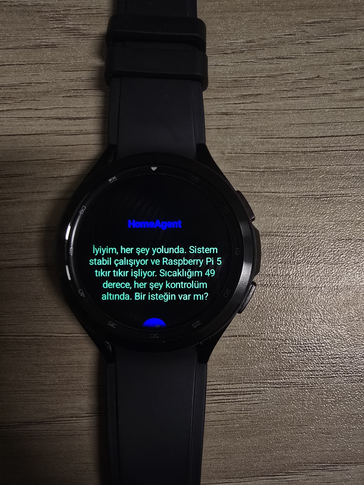
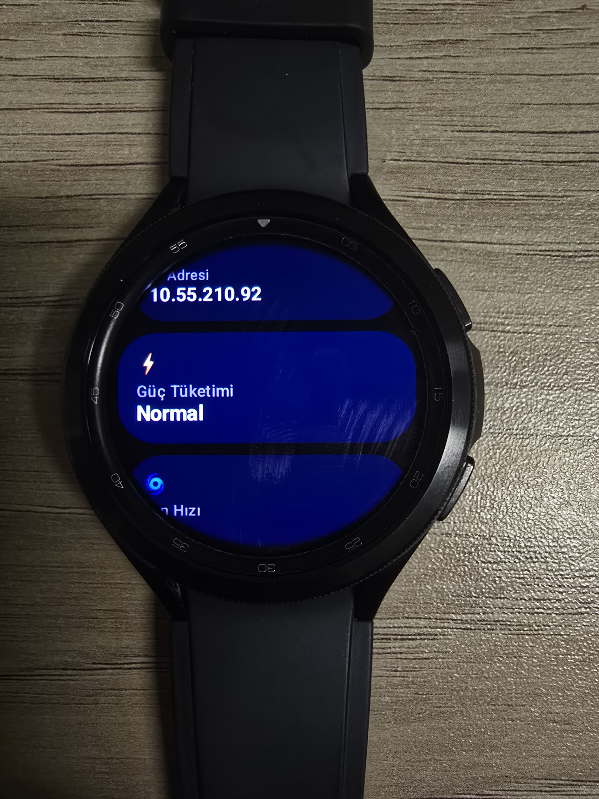
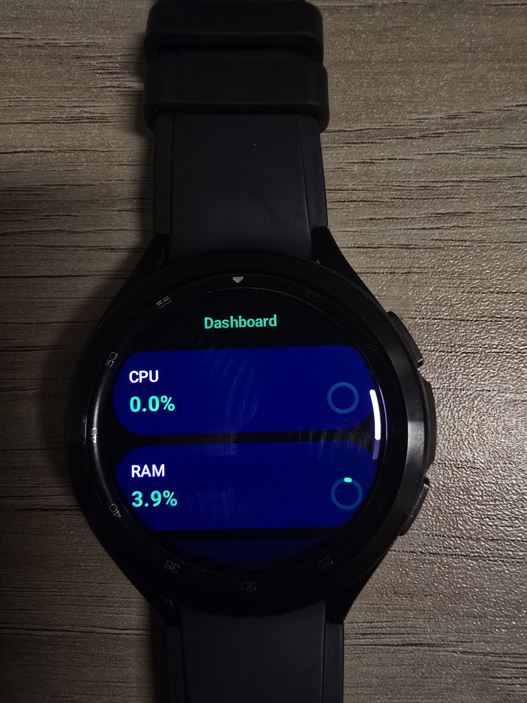

# ⌚ AgentJee — Wear OS Companion for HomeAgent

AgentJee is the Wear OS companion app for the HomeAgent smart home system, designed for Samsung Galaxy Watch 4 Classic and other Wear OS 3+ devices. It provides a wrist-level interface to monitor your Raspberry Pi's system health and manage files on the go.

## 📸 Screenshots

<table>
  <tr>
    <td></td>
    <td></td>
    <td></td>
  </tr>
  <tr>
    <td></td>
    <td></td>
    <td></td>
  </tr>
</table>

## ✨ Features

- **Dashboard** — Real-time CPU, RAM, Disk usage and CPU temperature (auto-refreshes every 3s)
- **File Manager** — Browse mounted drives and directories on your Pi directly from your wrist
- **System Controls** — Reboot or shutdown the Pi with a confirmation step
- **Settings** — View IP address, power status, fan info
- **Bezel Navigation** — Navigate menus and scroll pages using the watch's rotating bezel
- **Back Button Handling** — Context-aware back navigation through menu hierarchy

## 🛠 Tech Stack

| Layer | Technology |
|---|---|
| Language | Kotlin |
| UI Framework | Jetpack Compose for Wear OS |
| Networking | OkHttp3 |
| Async | Kotlin Coroutines |
| Min SDK | API 30 (Wear OS 3) |
| Target SDK | API 36 (Wear OS 6) |

## 🚀 Getting Started

### Prerequisites

- Android Studio Hedgehog or newer
- A running [HomeAgent](https://github.com/serhanensar/HomeAgent) backend instance
- Wear OS device or emulator (API 30+)

### Setup

1. Clone the repository:
   ```bash
   git clone https://github.com/serhanensar/HomeAgent_Wear.git
   ```

2. Open the project in Android Studio and wait for Gradle sync.

3. Configure your API key:
   - Add to your `local.properties` file:
     ```properties
     HOME_AGENT_API_KEY=your_api_key_here
     ```
   - The key is injected at build time via `BuildConfig`.

4. Set your HomeAgent server URL in `ApiClient.kt`:
   ```kotlin
   private var baseUrl = "http://AgentJee.local:8000"
   // Or use your Pi's static IP
   ```

### Deploy

**To an emulator:**
- Device Manager → Wear OS XL Round (API 36, arm64) → Start → Run ▶

**To a real watch (Wi-Fi ADB):**
```bash
adb connect <WATCH_IP>:5555
adb devices
# Select the watch in Android Studio → Run ▶
```

## 📡 HomeAgent API Compatibility

AgentJee communicates with the following HomeAgent endpoints:

| Endpoint | Purpose |
|---|---|
| `GET /api/status?api_key=` | System stats |
| `GET /api/files/devices?api_key=` | Mounted drives list |
| `GET /api/files/list?...` | Directory contents |
| `POST /api/system/reboot` | Reboot Pi |
| `POST /api/system/shutdown` | Shutdown Pi |

## 🔒 Security

- **API Key** is NOT hardcoded — it must be configured via `local.properties` and injected through `BuildConfig`.
- Never commit `local.properties` to version control (it is in `.gitignore`).
- Wi-Fi credentials for the ESP32 display client must be configured locally and must never be committed.

## 🔗 HomeAgent Ecosystem

| Project | Description |
|---|---|
| [HomeAgent](https://github.com/serhanensar/HomeAgent) | Python FastAPI backend (Raspberry Pi) |
| [HomeAgent-Mobile-K](https://github.com/serhanensar/HomeAgent-Mobile-K) | Android/Tablet app (Jetpack Compose) |
| [HomeAgentMobile](https://github.com/serhanensar/HomeAgentMobile) | Cross-platform mobile app (Expo) |

## 📄 License

MIT
